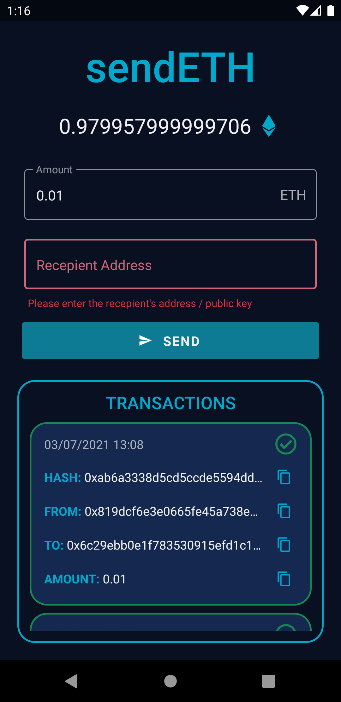

# sendETH

This is a mobile app created for an interview test.

**Framework:** React Native (React Native CLI)

**Version:** 0.64.2

## Installation Steps

Setup the React Native CLI Development environment for your machine if you haven't already: [Follow this guide](https://reactnative.dev/docs/environment-setup)

Now, follow the below steps in order to run the app:

1. Clone this repo using Sourcetree or using git: `git clone https://github.com/Cypherball/sendETH.git`

2. `cd sendETH`

3. `npm i` to install node packages (use _`--force`_ argument if any dependency error occurs)

4. `cd ios && pod install` to generate ios pod files (skip if building for android only on windows)

5. `cd ../` traverse back to the root directory

6. `npx react-native start` to start the metro server (keep running in terminal)

7. `react-native run-android` (in separate/new terminal) to run app in android simulator. Before running android please open the android simulator to run the app

8. `react-native run-ios` (in separate/new terminal) to run the app in ios simulator

## App Features

- Sending Ether using Ropsten testnet
- Check Account's Ether Balance
- View All Transactions
- Transaction Status (Does not display pending transactions)
- Input Validation
- **NOTE:** You need to refresh manually after waiting for a few moments after sending a transaction, since the API does not immediately retrieve it.

## Details

- My testnet private key is hardcoded into the app which is visible in _`./src/config/index.js`_
- [_Ethers_](https://www.npmjs.com/package/ethers) Library is used to send transactions between accounts and retreive account balance.
- [_Etherscan API_](https://etherscan.io/apis) is used to fetch the account's list of transactions.
- [_Validator_](https://www.npmjs.com/package/validator) Library is used for validations.
- [_React-Native-Paper_](https://www.npmjs.com/package/react-native-paper) Library is used for the UI.
